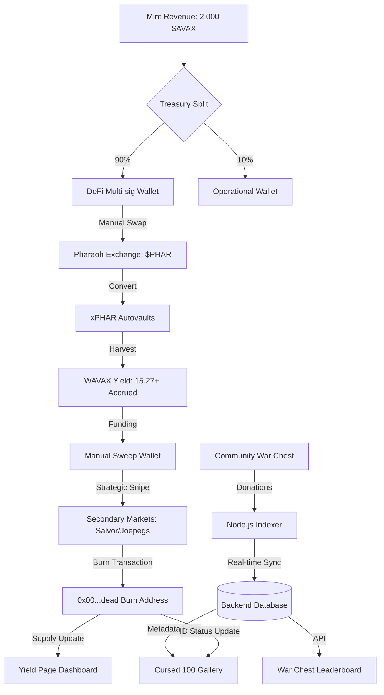

# 🔥 Lil Burn (Lil-B)

- `apps/web` DAPP
- `packages/contracts` Smart contracts
- `packages/scripts` Snapshot, merkle tree, and metadata generation scripts
- `packages/types` Shared types

### A Hyper-Deflationary NFT Survival Experiment on Avalanche

Lil Burn is a tactical NFT protocol where survival is the only goal. By deploying 90% of mint funds into Avalanche DeFi, the protocol generates autonomous yield to systematically buy back and burn the supply until only the **Final 100 Elite** remain.

---

## ⚙️ The Protocol

### 1. Yield & Harvest

- **The Deployment:** Following the 1,000 NFT mint, the treasury executes a strategic deployment into the Pharaoh Exchange ecosystem:
  - **Strategic Swap**: **90% of $AVAX mint funds** are converted into $PHAR.
  - **$xPHAR Conversion**: All acquired $PHAR is committed to the xPHAR governance layer, securing a long-term, yield-bearing position.
  - **Autovault Staking**: The xPHAR is staked in Pharaoh’s **Automated autovault**, maximizing yield while eliminating manual management.
- **The 80/20 Efficiency Rule:** Yield is harvested bi-weekly and distributed:
  - 🔥 **80% (The Purge Fund):** Used exclusively to sweep the Lil Burn floor.
  - 🐓 **5%:** Lil Coq Rewards (supporting ecosystem project).
  - 💎 **5%:** $LIL Staking Rewards (supporting ecosystem project).
  - 🛡️ **10%:** Team Treasury for ecosystem operations and future development.

### 2. The Purge (Bi-Weekly Execution)

The team enters the market every two weeks with one goal: **Delete the Floor.**

- **Ammunition:** 80% of harvested yield is converted to $AVAX.
- **Casualties:** The team market-buys the lowest-priced NFTs.
- **The Furnace:** Purchased NFTs are sent to a dead address forever.

### 3. The Purge Execution (Strategic Manual Sweep)

To ensure absolute fairness and adherence to protocol logic, "The Purge" is executed manually. This prevents "Dumb Bots" from sweeping the wrong assets and allows for precise tie-breaking:

1. **Scan:** The team identifies all NFTs listed at the current floor price.
2. **Priority Tie-Breaker:** In the event that multiple NFTs are listed at the same price, the team cross-references the **Sweep Score** (Mint Priority).
3. **Selection:** The NFT with the **Highest Sweep Score** (earlier mint) is selected for the Purge first.
4. **Execution:** This creates a tactical advantage for early minters: their "Floor Shield" is stronger, as they will be the first to be bought out by the team if they choose to exit at the floor.

---

## 🏗️ Architecture Overview

The Lil-Burn ecosystem is a closed-loop deflationary engine that converts NFT mint revenue and community contributions into persistent buy-pressure on the Avalanche C-Chain.

### 1. Technical Component Breakdown

- **Yield Engine**: A team-managed DeFi strategy. 1,800 $AVAX is systematically swapped for **$PHAR\*\* and staked as xPHAR on Pharaoh Exchange. This generates continuous $WAVAX yield used for market buy-backs.
- **The War Chest**: A donation-based smart contract that triggers a Node.js indexer. It records donor data in a PostgreSQL/MongoDB database to serve the real-time Quarterly Leaderboard.
- **Cursed ID Tracker**: A database-driven gallery that cross-references the "Cursed 100" NFT metadata against the burn address, allowing users to filter "At-Large" vs. "Graveyarded" assets.

### 2. Technical Stack

- **Smart Contracts**: Solidity (Avalanche C-Chain).
- **Frontend**: Next.js, Tailwind CSS.
- **Web3 Integration**: WalletConnect with custom network-switching logic.
- **Backend**: Node.js, Express, Database (for Leaderboards/Metadata).
- **DeFi Integration**: Pharaoh Exchange (xPHAR Autovaults).

---

## 🛡️ Survival Mechanics

### 1. Sweep Score (Priority & Tie-Breaker)

Your mint order is your life insurance.

- **The Logic:** Earlier mints have higher scores (Mint #1 = 1,000; Mint #1,000 = 1).
- **The Shield:** If multiple NFTs are at the same floor price, the one with the **Highest Sweep Score** is bought and burned first. High-score holders can "match" the floor, while low-score holders must undercut to get out.

### 2. The Floor War (The Strategic Standoff)

Holders compete for the "exit lane" during the Purge Window.

- **The Sprint:** When the Purge budget is announced, holders race to undercut the floor to ensure they are the ones bought by the team.
- **The Result:** The winner gets the $AVAX; the loser stays in the game.

### 3. The War Chest (Community Weapon)

A transparent, public wallet where 100% of voluntary contributions are used to buy and burn NFTs.

- **Autonomous Trigger:** A "Tactical Sweep" occurs whenever the wallet balance matches the floor price.
- **Leaderboards:** Top donors (Burn Architects) earn rewards and airdrops.

---

## 💀 The Endgame

### 1. The Cursed 100 (The Landmines)

There are 100 "Cursed" NFT IDs hidden in the supply.

- **The Reveal:** As supply milestones (800, 600, etc.) are hit, the "Hashed Manifest" decrypts, revealing which IDs are Cursed.
- **The Strategy:** If your NFT is revealed as Cursed, you must use the Floor War to get swept/bought by the team. Cursed NFTs that reach the final 100 are **disqualified** from rewards.

### 2. The Final 100 Elite

When the supply hits 100, the burn stops.

- **Concentrated Yield:** These 100 survivors become the sole beneficiaries of the perpetual yield engine.
- **The Survivor's Bonus:** Any yield meant for "Cursed" survivors is redistributed to the "Clean" holders.

---

## 🔗 Official Links

- [Documentation](https://lil-ecosystem.gitbook.io/lil-burn)
- [Twitter](https://x.com/LilCoqNft)
- [Discord](https://discord.gg/uKSF7R2dJd)
